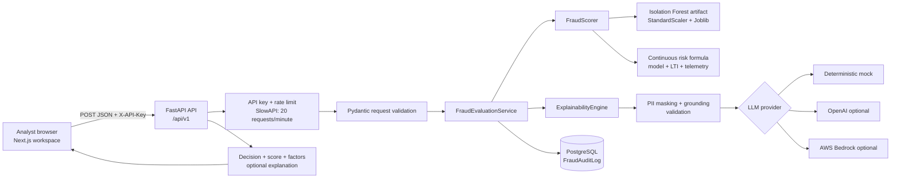
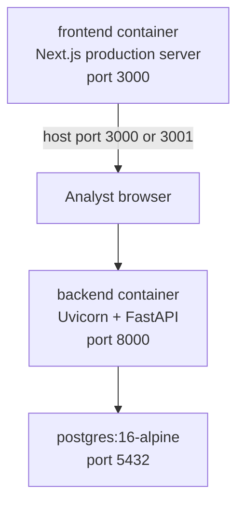
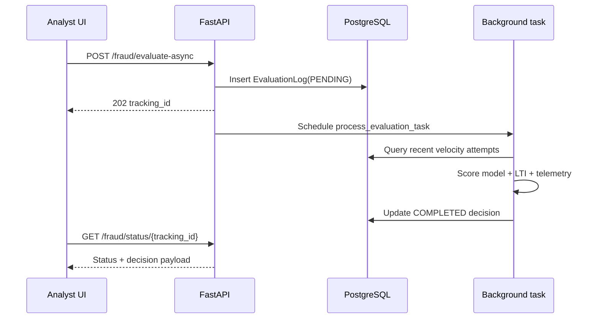

# Fraud Guard

Fraud Guard is a real-time fraud-risk assessment platform for digital loan applications. It combines behavioral telemetry, a persisted scikit-learn Isolation Forest model, continuous loan-to-income scoring, configurable signal weights, deterministic explanations, and a Next.js analyst workspace.

The current scoring path is deliberately stateless with respect to historical fraud decisions: PostgreSQL stores audit records after an assessment, but repeat-offender and historical vector matching are not used to calculate the current risk score.

## Architecture



### Runtime containers



Docker Compose starts three services:

- `postgres`: audit database and health-check dependency.
- `backend`: FastAPI application, model loading, scoring, explanations, and audit writes.
- `frontend`: compiled Next.js analyst interface.

## End-to-End Request Flow

1. An analyst opens the Next.js workspace and enters an applicant ID, loan amount, annual income, and telemetry values.
2. The browser sends `POST /api/v1/fraud/evaluate` with JSON and the `X-API-Key` header.
3. FastAPI applies CORS, rate limiting, API-key authentication, and Pydantic validation.
4. `FraudEvaluationService` extracts the six model features and calls the warm `FraudScorer`.
5. `FraudScorer` calculates the model anomaly component, continuous LTI component, and telemetry component.
6. The service maps the bounded score to `LOW`, `MEDIUM`, or `HIGH` and selects `APPROVE`, `STEP_UP_AUTHENTICATION`, or `BLOCK`.
7. If requested, `ExplainabilityEngine` creates a grounded explanation using the same factors that produced the score. The default mock provider is deterministic and offline-safe.
8. The velocity check queries recent `EvaluationLog` records for the same explicit `user_id`, `device_id`, or IP address. More than three matching attempts in the last ten minutes adds `HIGH_VELOCITY_ATTEMPT` and forces a `0.90/HIGH/BLOCK` result.
9. The completed decision is written to `FraudAuditLog` and, for queued work, updates `EvaluationLog`. These records support audit and velocity tracking; historical vector matching is not used.
10. The API returns the validated assessment. The frontend stores it in session storage and navigates to `/assessment`.

### Background evaluation flow

The asynchronous endpoint creates a `PENDING` `EvaluationLog`, schedules a FastAPI `BackgroundTasks` job, and returns immediately with a UUID tracking ID. The task opens its own SQLAlchemy session, performs the same velocity and scoring logic, then stores the completed decision or marks the record `FAILED`.



## Risk Scoring

### Input identifiers

The request uses explicit identifiers supplied by the client:

- `applicant_id`: application/applicant identifier.
- `telemetry.device_id`: explicit device identifier.
- `telemetry.session_id`: optional session identifier.

The service does not perform browser fingerprinting, repeat-offender escalation, or historical vector matching. A legacy `device_fingerprint_id` field is accepted as an input alias for compatibility, but it is normalized to `device_id` and is not used as a historical scoring signal.

### Model features

The Isolation Forest receives these features:

```text
[typing_speed_wpm,
 paste_event_count,
 mouse_jitter_score,
 session_duration_seconds,
 is_vpn_as_0_or_1,
 loan_amount / annual_income]
```

The model is trained on synthetic normal telemetry by `backend/app/ml/trainer.py` and persisted to `backend/app/ml/artifacts/saved_model.pkl`. At application startup, the artifact is loaded once and reused for requests.

### Continuous formula

The final risk score is bounded to `[0.0, 1.0]`:

```text
model_risk = clip((training_score_max - raw_isolation_score)
                  / (training_score_max - training_score_min), 0, 1)

lti_ratio = loan_amount / max(annual_income, 1.0)
scaled_lti = lti_ratio / LTI_RISK_SCALE
lti_risk = scaled_lti / (1 + scaled_lti)

telemetry_risk = flagged_telemetry_signals / total_telemetry_signals

risk_score = clip(
    MODEL_RISK_WEIGHT * model_risk
  + LTI_RISK_WEIGHT * lti_risk
  + TELEMETRY_RISK_WEIGHT * telemetry_risk,
  0,
  1
)
```

Default weights are configurable and sum to one:

| Component | Default weight | Meaning |
| --- | ---: | --- |
| Model anomaly | `0.10` | Isolation Forest outlier signal |
| LTI | `0.85` | Continuous loan-to-income signal |
| Telemetry | `0.05` | Paste, VPN, typing, and mouse signals |

The LTI curve is continuous rather than a set of fixed score buckets. With the current artifact and defaults, representative results are approximately:

| Example | Approximate score |
| --- | ---: |
| `$25` loan / `$10,000` income | `0.087` |
| `$2,500` loan / `$10,000` income | `0.196` |
| `$5,000` loan / `$6,000` income | `0.402` |
| `$25,000` loan / `$100` income | `0.889` |

The exact score also reflects model and telemetry inputs.

### Decision policy

Thresholds are configuration values, not hardcoded return values:

- `risk_score < FRAUD_THRESHOLD_MEDIUM`: `LOW`, `APPROVE`
- `FRAUD_THRESHOLD_MEDIUM <= risk_score < FRAUD_THRESHOLD_HIGH`: `MEDIUM`, `STEP_UP_AUTHENTICATION`
- `risk_score >= FRAUD_THRESHOLD_HIGH`: `HIGH`, `BLOCK`

The default thresholds are `0.30` and `0.80`.

## API Contract

### Health

```http
GET /api/v1/health
```

Returns service status, database connectivity, and uptime.

### Fraud evaluation

```http
POST /api/v1/fraud/evaluate?include_explanation=true
X-API-Key: <API_KEY>
Content-Type: application/json
```

Example request:

```json
{
  "applicant_id": "APP-1001",
  "loan_amount": 25000,
  "annual_income": 100,
  "requested_term_months": 24,
  "is_developer_mode": false,
  "telemetry": {
    "typing_speed_wpm": 65,
    "paste_event_count": 0,
    "mouse_jitter_score": 0.8,
    "session_duration_seconds": 45,
    "ip_address": "192.168.1.1",
    "device_id": "device-1001",
    "session_id": "session-1001",
    "is_vpn": false
  }
}
```

The response contains `risk_score`, `risk_level`, `recommended_action`, `top_risk_factors`, timestamps, PII status, and an optional grounded explanation.

### Metrics

```http
GET /api/v1/metrics
X-API-Key: <API_KEY>
```

Metrics are calculated from persisted audit records, including total evaluations, fraud rate, risk distribution, and velocity/audit data. Historical records are not used for device or vector matching.

### Async status

```http
POST /api/v1/fraud/evaluate-async
GET /api/v1/fraud/status/{tracking_id}
```

The first call returns `202 Accepted`:

```json
{"tracking_id": "<uuid>", "status": "PENDING"}
```

The status endpoint returns `PENDING`, `COMPLETED`, or `FAILED`. A completed response includes the full `FraudAssessmentResponse` under `decision`.

### Analyst review and override

```http
GET /api/v1/analyst/pending-reviews
POST /api/v1/analyst/override
```

Both endpoints require `X-API-Key`. Pending reviews list completed MEDIUM and HIGH evaluations. An override requires an evaluation ID, analyst ID, new decision, and reason:

```json
{
  "evaluation_id": "<evaluation-log-uuid>",
  "analyst_id": "analyst-1",
  "new_decision": "APPROVED",
  "reason": "Verified income via bank statements"
}
```

The override creates an immutable `AuditLog` entry and updates the evaluation record's decision label.

## Project Layout

```text
backend/
  app/
    main.py                         FastAPI app, middleware, lifespan
    api/v1/endpoints/               Health, fraud, metrics, and analyst routes
    core/config.py                  Environment-backed settings
    core/security.py                X-API-Key authentication
    core/rate_limit.py              SlowAPI limiter
    db/                             SQLAlchemy engine, evaluation, and audit models
    ml/model.py                     Scorer wrapper and continuous formula
    ml/trainer.py                   Synthetic training data and artifact creation
    services/fraud_service.py       Evaluation orchestration and audit persistence
    services/explainability_service.py
    services/guardrails.py          PII masking and grounding checks
    models/schemas.py               Request and response contracts
  tests/                            Backend regression suite
frontend/
  src/app/page.tsx                  Analyst home page
  src/app/assessment/page.tsx       Assessment result page
  src/components/                   Form, result, and metrics UI
  src/lib/api.ts                    Browser API client
scripts/evaluate_model.py           Offline model benchmark
scripts/smoke_test.py               Live API smoke test
render.yaml                         Render backend, frontend, and database services
docker-compose.yml                  Local multi-container deployment
```

## Local Docker Deployment

```bash
docker compose up --build -d
```

Open:

- Frontend: [http://localhost:3000](http://localhost:3000)
- Backend health: [http://localhost:8000/api/v1/health](http://localhost:8000/api/v1/health)
- Swagger: [http://localhost:8000/docs](http://localhost:8000/docs)

If port `3000` is already occupied on Windows, use another host port:

```powershell
$env:FRONTEND_PORT="3001"
docker compose up --build -d
```

Then open [http://localhost:3001](http://localhost:3001).

Stop the stack:

```bash
docker compose down
```

## Local Development Without Docker

### Backend

```powershell
cd backend
python -m venv .venv
.\.venv\Scripts\Activate.ps1
pip install -r requirements.txt
python -m app.ml.trainer
uvicorn app.main:app --reload --port 8000
```

### Frontend

```powershell
cd frontend
npm ci
npm run dev
```

`frontend/.env.local` should contain:

```env
NEXT_PUBLIC_API_URL=http://localhost:8000
NEXT_PUBLIC_API_KEY=fg-sk-dev-hackathon-key-2026
```

The client normalizes the URL to `/api/v1` and sends `X-API-Key` on API requests.

## Testing and Validation

Run the complete backend suite from the repository root:

```bash
python -m pytest backend/tests -v
```

Run frontend checks:

```bash
cd frontend
npm run lint
npm run build
```

Run the offline benchmark:

```bash
python scripts/evaluate_model.py
```

The benchmark prints raw and calibrated score ranges, label distribution, threshold counts, precision, recall, F1, and false-positive rate. It evaluates the configured HIGH-risk operating point rather than treating every MEDIUM step-up decision as confirmed fraud.

Run the live smoke test while the API is running:

```bash
python scripts/smoke_test.py
```

The suite covers API validation, authentication, health, metrics, vector utility behavior, explainability grounding, continuous LTI scoring, and developer-mode request handling.

## Explainability and Privacy

Before an optional external explanation request:

1. Applicant IDs are anonymized.
2. IP addresses are masked.
3. Explicit device IDs are masked before entering the explanation context.
4. The provider response is validated against `AIExplanation`.
5. Explanation points are checked against model-generated risk factors.
6. Provider failures fall back to a deterministic mock explanation.

The default `LLM_PROVIDER=mock` keeps local development and Docker demos offline.

## Deployment

### Docker Compose

Compose builds the backend and frontend images, starts PostgreSQL, waits for health checks, and exposes the services locally.

### Render

`render.yaml` defines:

- A Python web service running Uvicorn from `backend/`.
- A Node web service building and serving `frontend/`.
- A managed PostgreSQL database.

Set production secrets through the Render dashboard or environment configuration. Do not commit production API keys to the repository. Update `NEXT_PUBLIC_API_URL` to the deployed backend URL and ensure the backend `ALLOWED_ORIGINS` includes the deployed frontend origin.

## Configuration Reference

The backend uses `pydantic-settings`. Environment variables override `.env` values and class defaults.

Important settings:

| Setting | Default | Purpose |
| --- | --- | --- |
| `FRAUD_THRESHOLD_MEDIUM` | `0.30` | MEDIUM decision boundary |
| `FRAUD_THRESHOLD_HIGH` | `0.80` | HIGH/BLOCK decision boundary |
| `MODEL_RISK_WEIGHT` | `0.10` | Isolation Forest contribution |
| `LTI_RISK_WEIGHT` | `0.85` | Continuous LTI contribution |
| `TELEMETRY_RISK_WEIGHT` | `0.05` | Behavioral telemetry contribution |
| `LTI_RISK_SCALE` | `1.0` | Shape of the bounded LTI curve |
| `PASTE_COUNT_THRESHOLD` | `3` | Paste anomaly trigger |
| `TYPING_WPM_HIGH` | `150.0` | High typing cadence trigger |
| `TYPING_WPM_LOW` | `10.0` | Low typing cadence trigger |
| `MOUSE_JITTER_LOW` | `0.05` | Low-human-movement trigger |
| `VELOCITY_WINDOW_MINUTES` | `10` | Recent-attempt tracking window |
| `VELOCITY_MAX_ATTEMPTS` | `3` | Attempts allowed before velocity blocking |
| `LLM_PROVIDER` | `mock` | `mock`, `openai`, or `bedrock` |
| `DATABASE_URL` | SQLite local default | Audit database connection |

Never commit real API keys, database passwords, or cloud credentials.
